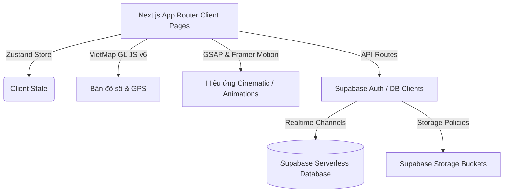

# BÁO CÁO CHI TIẾT DỰ ÁN: ĐN-UniShare

## Nền tảng chia sẻ và trao đổi đồ dùng học tập dành cho cộng đồng sinh viên Làng Đại học Đà Nẵng

---

## MỤC LỤC

1. [Tổng quan dự án](#1-tổng-quan-dự-án)
2. [Kiến trúc & Công nghệ (Tech Stack)](#2-kiến-trúc--công-nghệ-tech-stack)
3. [Thiết kế Cơ sở Dữ liệu (Supabase Database Schema)](#3-thiết-kế-cơ-sở-dữ-liệu-supabase-database-schema)
4. [Các tính năng cốt lõi (Core Features)](#4-các-tính-năng-cốt-lõi-core-features)
5. [Thiết kế giao diện & Trải nghiệm người dùng (UI/UX)](#5-thiết-kế-giao-diện--trải-nghiệm-người-dùng-uiux)
6. [Cơ chế Bảo mật & An toàn giao dịch](#6-cơ-chế-bảo-mật--an-toàn-giao-dịch)
7. [Định hướng phát triển tương lai](#7-định-hướng-phát triển-tương-lai)

---

## 1. TỔNG QUAN DỰ ÁN

### 1.1. Bối cảnh & Thực trạng
Hằng năm, khi kết thúc khóa học hoặc chuyển trọ, sinh viên tại Làng Đại học Đà Nẵng thải ra một lượng lớn sách vở, giáo trình, đồ gia dụng ký túc xá và tài liệu học tập vẫn còn giá trị sử dụng. Phần lớn các vật dụng này bị bỏ phí hoặc bán thanh lý giá rẻ. Trong khi đó, các khóa tân sinh viên bước vào giảng đường lại phải đầu tư khoản chi phí đáng kể để mua mới các trang thiết bị tương tự.

### 1.2. Giải pháp ĐN-UniShare
**ĐN-UniShare** ra đời như một giải pháp công nghệ kết nối sẻ chia phi lợi nhuận. Nền tảng cho phép sinh viên đăng tải các món đồ không còn nhu cầu sử dụng để tặng miễn phí hoặc trao đổi với các sinh viên khác trong cùng khu vực Làng Đại học.

### 1.3. Giá trị cốt lõi
*   **Tiết kiệm chi phí:** Hỗ trợ trực tiếp tài chính cho sinh viên khó khăn thông qua giáo trình và đồ dùng học tập miễn phí hoặc giá rẻ.
*   **Bảo vệ môi trường:** Tái tuần hoàn vòng đời sản phẩm, giảm thiểu lượng rác thải nhựa và giấy ra môi trường.
*   **Gắn kết cộng đồng:** Xây dựng một văn hóa tử tế, chia sẻ và giúp đỡ lẫn nhau giữa sinh viên các trường thành viên thuộc Đại học Đà Nẵng.

---

## 2. KIẾN TRÚC & CÔNG NGHỆ (TECH STACK)

Dự án được xây dựng dựa trên các công nghệ web hiện đại, hướng tới hiệu năng cao, giao diện mượt mà và khả năng cập nhật thời gian thực (Real-time).



### 2.1. Frontend Framework
*   **Next.js (v16.1+ App Router):** Tối ưu hóa SEO, kết xuất phía máy chủ (SSR) kết hợp linh hoạt với kết xuất phía khách (Client-side rendering).
*   **React 19:** Sử dụng các tính năng mới nhất để tối ưu hóa hiệu năng render component.
*   **TypeScript:** Đảm bảo an toàn kiểu dữ liệu (type safety) cho toàn bộ logic hệ thống.

### 2.2. Backend & Database (BaaS)
*   **Supabase (PostgreSQL):** Hệ quản trị cơ sở dữ liệu mạnh mẽ cung cấp đầy đủ các cổng giao tiếp API RESTful và Real-time tự động.
*   **Supabase Realtime:** Sử dụng giao thức WebSockets để đồng bộ hóa tin nhắn tức thời và cập nhật trạng thái yêu cầu đồ dùng theo thời gian thực.
*   **Supabase Storage:** Lưu trữ hình ảnh sản phẩm đăng tải thông qua các chính sách bảo mật chặt chẽ.

### 2.3. Quản lý trạng thái (State Management)
*   **Zustand (v5.0):** Quản lý trạng thái global gọn nhẹ, dễ dàng cấu trúc và đồng bộ hóa dữ liệu từ Supabase về client-side.

### 2.4. Bản đồ & GIS (Geographic Information System)
*   **VietMap GL JS (v6.0):** Tích hợp bản đồ số thuần Việt chất lượng cao cho việc xác định tọa độ giao nhận và điểm hẹn an toàn tại Đà Nẵng.
*   **Nominatim OpenStreetMap API:** Cung cấp tính năng tìm kiếm và tự động hoàn thành địa chỉ (Address Autocomplete) miễn phí, không phụ thuộc vào các thư viện trả phí.

### 2.5. Phong cách thiết kế & Animation (Aesthetics)
*   **TailwindCSS v4 & CSS Variables:** Xây dựng hệ thống Design Tokens nhất quán (`tokens.css`), dễ dàng chuyển đổi Dark/Light mode tự động dựa trên cấu hình hệ điều hành của người dùng.
*   **GSAP (GreenSock Animation Platform):** Xử lý các hiệu ứng cuộn trang (ScrollTrigger) và giới thiệu cinematic cao cấp trên trang chủ.
*   **Framer Motion:** Tạo các chuyển động mượt mà cho các phần tử UI tương tác (Modals, Tabs, Hover Effects, Cards).

---

## 3. THIẾT KẾ CƠ SỞ DỮ LIỆU (SUPABASE DATABASE SCHEMA)

Hệ thống cơ sở dữ liệu PostgreSQL trên Supabase được chuẩn hóa gồm 7 bảng nghiệp vụ liên kết chặt chẽ:

```
                  ┌──────────────┐          ┌──────────────┐
                  │    users     ├─────────►│   ratings    │
                  └──────┬───────┘          └──────────────┘
                         │ 1
                         │
                         ├────────────────────────────────────────┐
                         │                                        │
                         ▼ 1..*                                   ▼ 1..*
                  ┌──────────────┐ 1        ┌──────────────┐ 1..* ┌──────────────┐
                  │    items     │◄─────────┤   requests   ├─────►│  favorites   │
                  └──────┬───────┘          └──────────────┘      └──────────────┘
                         │ 1 (optional)
                         │
                         ▼ 0..*
                  ┌──────────────┐ 1        ┌──────────────┐
                  │conversations ├─────────►│   messages   │
                  └──────────────┘          └──────────────┘
```

### 3.1. Các bảng dữ liệu chính

#### 1. Users (`public.users`)
Lưu trữ thông tin chi tiết của sinh viên, được đồng bộ mở rộng từ bảng Auth mặc định của Supabase.
*   `id` (UUID, Primary Key): ID định danh người dùng.
*   `email` (TEXT, Unique): Địa chỉ email sinh viên.
*   `name` (TEXT): Tên hiển thị của sinh viên.
*   `avatar` (TEXT, Nullable): Đường dẫn ảnh đại diện.
*   `faculty` (TEXT, Default 'Khác'): Khoa/Trường đang theo học (VD: CNTT - ĐH Bách Khoa).
*   `role` (TEXT, Check: user/admin): Quyền hạn trong hệ thống.
*   `rating_avg` (DECIMAL, Default 0): Điểm đánh giá uy tín trung bình (tối đa 5.0).
*   `rating_count` (INTEGER, Default 0): Tổng số lượt đánh giá nhận được.
*   `created_at`, `updated_at` (TIMESTAMPTZ).

#### 2. Items (`public.items`)
Lưu trữ danh sách các vật phẩm đăng tải chia sẻ hoặc trao đổi.
*   `id` (UUID, Primary Key): ID định danh vật phẩm.
*   `title` (TEXT): Tiêu đề tin đăng.
*   `description` (TEXT): Mô tả chi tiết vật phẩm.
*   `category` (TEXT, Check: sach, do-hoc-tap, do-ktx, suatan, tailieu, khac): Phân loại sản phẩm.
*   `condition` (TEXT, Check: moi, tot, kha, cu): Hiện trạng vật dụng.
*   `exchange_type` (TEXT, Check: mienphi, traodoi, sale, lost, found): Hình thức giao dịch (Tặng miễn phí, Trao đổi đồ, Bán rẻ, Mất đồ, Nhặt được đồ).
*   `image` (TEXT): Đường dẫn hình ảnh vật phẩm.
*   `location` (TEXT): Điểm hẹn bàn giao (VD: KTX Làng Đại học).
*   `posted_by` (TEXT): Tên người đăng tin.
*   `poster_id` (UUID, Foreign Key -> `users.id`): ID tài khoản người đăng.
*   `poster_faculty` (TEXT): Khoa/Trường của người đăng.
*   `status` (TEXT, Check: available, reserved, completed, cancelled): Trạng thái tin đăng.
*   `requested_count` (INTEGER, Default 0): Số lượt sinh viên gửi yêu cầu món đồ này.
*   `is_featured` (BOOLEAN, Default false): Đánh dấu tin nổi bật hiển thị ở trang chủ.
*   `price` (NUMERIC, Nullable): Giá bán (nếu hình thức là `sale`).
*   `latitude`, `longitude` (DOUBLE PRECISION, Nullable): Tọa độ địa lý GPS của món đồ phục vụ bản đồ và radar quét.

#### 3. Requests (`public.requests`)
Ghi nhận các yêu cầu xin đồ hoặc trao đổi từ sinh viên khác gửi tới người đăng tin.
*   `id` (UUID, Primary Key).
*   `item_id` (UUID, Foreign Key -> `items.id`): ID món đồ được yêu cầu.
*   `item_title` (TEXT): Lưu nhanh tiêu đề món đồ để hiển thị nhanh.
*   `requester_id` (UUID, Foreign Key -> `users.id`): ID người gửi yêu cầu.
*   `requester_name` (TEXT): Tên người gửi yêu cầu.
*   `poster_name` (TEXT): Tên chủ tin đăng.
*   `status` (TEXT, Check: pending, accepted, rejected, collected): Trạng thái yêu cầu (Chờ duyệt, Đồng ý điểm hẹn, Từ chối, Đã nhận đồ).

#### 4. Favorites (`public.favorites`)
Lưu trữ danh sách tin đăng yêu thích của từng tài khoản.
*   `id` (UUID, Primary Key).
*   `user_id` (UUID, Foreign Key -> `users.id`).
*   `item_id` (UUID, Foreign Key -> `items.id`).
*   *Ràng buộc đặc biệt:* Duy nhất cặp `(user_id, item_id)` để tránh trùng lặp.

#### 5. Conversations (`public.conversations`)
Bảng quản lý phòng chat giữa các sinh viên khi đàm phán trao đổi đồ dùng.
*   `id` (UUID, Primary Key).
*   `participant_ids` (UUID[] - Mảng UUID): Chứa danh sách ID của hai người tham gia trò chuyện.
*   `participant_names` (TEXT[] - Mảng Tên): Tên các thành viên phòng chat.
*   `item_id` (UUID, Foreign Key -> `items.id`, On Delete Set Null): Món đồ đang được thảo luận thương lượng.
*   `item_title` (TEXT): Tên món đồ thảo luận.
*   `last_message` (TEXT): Nội dung tin nhắn cuối cùng để hiển thị bản xem trước ở danh sách chat.
*   `last_message_time` (TIMESTAMPTZ): Thời điểm nhắn tin cuối cùng để sắp xếp danh sách phòng chat.

#### 6. Messages (`public.messages`)
Chi tiết các tin nhắn gửi đi trong phòng chat.
*   `id` (UUID, Primary Key).
*   `conversation_id` (UUID, Foreign Key -> `conversations.id`).
*   `sender_id` (UUID, Foreign Key -> `users.id`).
*   `text` (TEXT): Nội dung tin nhắn văn bản.
*   `created_at` (TIMESTAMPTZ).

#### 7. Ratings (`public.ratings`)
Lưu trữ đánh giá độ tín nhiệm của sinh viên sau khi hoàn thành giao nhận đồ.
*   `id` (UUID, Primary Key).
*   `rater_id` (UUID, Foreign Key -> `users.id`): Người đánh giá.
*   `target_id` (UUID, Foreign Key -> `users.id`): Người được đánh giá.
*   `score` (INTEGER, Check: 1 đến 5): Số sao đánh giá.
*   `comment` (TEXT, Nullable): Ý kiến đóng góp chi tiết.
*   `item_id` (UUID, Foreign Key -> `items.id`): Món đồ giao dịch làm căn cứ đánh giá.

---

## 4. CÁC TÍNH NĂNG CỐT LÕI (CORE FEATURES)

### 4.1. Khám phá & Tìm kiếm nâng cao (Discover & Search Filter)
*   Hệ thống lọc đa chiều cho phép người dùng phân loại tin theo danh mục (Giáo trình, Đồ dùng học tập, Đồ KTX, Suất ăn, Tài liệu ôn thi...).
*   Tìm kiếm động theo từ khóa trong tiêu đề và mô tả.
*   Lọc theo mức độ mới của đồ dùng (Mới, Tốt, Khá, Cũ) và hình thức giao dịch.

### 4.2. Radar quét đồ lân cận (Radar Scan Nearby Items)
*   **Tính năng độc đáo:** Giúp sinh viên quét nhanh các vật dụng đang được chia sẻ quanh vị trí hiện tại trong bán kính 1.5 km.
*   **Thuật toán đo khoảng cách:** Sử dụng công thức toán học bán kính Trái Đất (Haversine) để tính cự ly chính xác theo mét giữa tọa độ GPS của thiết bị sinh viên và vật phẩm đăng tải.
*   **UI sống động:** Hiệu ứng quét sóng radar hình tròn bằng CSS phối hợp với chuyển động của Framer Motion. Mỗi chấm tròn trên màn hình radar đại diện cho một món đồ học tập và được phân màu trực quan tùy theo hình thức (Xanh lá: Miễn phí, Xanh dương: Trao đổi, Vàng: Bán rẻ, Đỏ: Tin thất lạc).

### 4.3. Bản đồ điểm hẹn an toàn (VietMap GL Integration)
*   **Bản đồ tương tác 3D:** Sử dụng thư viện `vietmap-gl` hiển thị chi tiết khu vực Làng Đại học Đà Nẵng với chế độ nghiêng 3D.
*   **Định vị GPS thời gian thực:** Người dùng có thể nhấn nút định vị để tự động chuyển tâm bản đồ về vị trí hiện tại của mình.
*   **Tìm kiếm địa chỉ thông minh:** Tích hợp ô tìm kiếm địa chỉ kết nối API địa lý Nominatim giúp ghim điểm hẹn chuẩn xác tại các khu giảng đường, nhà xe hay ký túc xá.
*   **Chỉ số an toàn (Safety Index):** Tích hợp thông tin hiển thị các điểm hẹn cố định (Thư viện Bách Khoa, KTX Làng Đại học, Sảnh Kinh tế...) kèm ghi chú an toàn (có đèn đường sáng, có camera an ninh giám sát, khu vực đông người qua lại) nhằm bảo vệ an toàn tối đa cho sinh viên khi đi giao nhận đồ vào buổi tối.

### 4.4. Cổng thanh toán giả lập thông minh (Secure Unified Payment)
Hỗ trợ các món đồ thanh toán giao dịch (như các suất ăn, voucher hay đồ thanh lý giá rẻ) với luồng thanh toán giả lập hoàn chỉnh mô phỏng môi trường thực tế:
*   **Chuyển khoản VietQR:** Tự động tạo mã QR chứa thông tin số tài khoản, số tiền và nội dung chuyển khoản động được mã hóa an toàn.
*   **Thẻ tín dụng Quốc tế (Visa / Mastercard):** Thiết kế trực quan với hiệu ứng lật thẻ 3D (lật mặt sau khi điền mã bảo mật CVV) mang lại trải nghiệm hiện đại bậc nhất.
*   **Ví điện tử UniPay:** Hệ thống ví điện tử tích hợp sẵn trong tài khoản sinh viên với số dư giả định hỗ trợ thanh toán trừ tiền trực tiếp tức thời.
*   **Vận chuyển đa dạng:** Lựa chọn hẹn gặp mặt lấy trực tiếp tại điểm hẹn (Miễn phí) hoặc yêu cầu dịch vụ Giao hàng tận phòng trọ (phí ship 15.000đ).

### 4.5. Chat thời gian thực (Real-time Messaging)
*   Kết nối trực tiếp giữa người xin và người cho ngay trên ứng dụng thông qua kênh Realtime của Supabase.
*   Không cần tải lại trang, tin nhắn gửi và nhận được cập nhật tức thời kèm theo thông báo trạng thái tin nhắn cuối cùng và thời gian tương ứng.

### 4.6. Thống kê tác động cộng đồng (Community Impact Board)
*   Hiển thị các chỉ số đo lường hiệu quả hoạt động: Tổng số sinh viên tham gia, số món đồ đã trao đổi thành công, khối lượng rác thải giảm thiểu tính bằng kg, và số tiền tiết kiệm được ước tính cho sinh viên.
*   Biểu đồ xu hướng cột đứng trực quan trực tiếp phản ánh số lượng giao dịch thành công tăng trưởng qua các tháng trong năm bằng công cụ vẽ đồ thị động của GSAP.

---

## 5. THIẾT KẾ GIAO DIỆN & TRẢI NGHIỆM NGƯỜI DÙNG (UI/UX)

### 5.1. Ngôn ngữ thiết kế
*   **Chủ đề tối (Dark Theme) làm chủ đạo:** Tạo cảm giác công nghệ, hiện đại và cao cấp, kết hợp hài hòa các mảng màu neon (Xanh lam, Xanh ngọc, Hồng cánh sen) làm điểm nhấn thu hút thị giác.
*   **Kính mờ (Glassmorphism):** Áp dụng hiệu ứng nền mờ `backdrop-blur` kết hợp với các đường viền mảnh phát sáng nhẹ tạo chiều sâu cho giao diện người dùng.
*   **Typography tinh tế:** Sử dụng font chữ 'Outfit' (sans-serif) và 'Fraunces' (serif) tải trực tiếp từ Google Fonts tạo cảm giác chuyên nghiệp, dễ đọc trên cả máy tính và điện thoại di động.

### 5.2. Chuyển động vi mô (Micro-interactions)
*   Hiệu ứng rê chuột (Hover) tăng kích thước nhẹ, phát sáng viền thẻ sản phẩm.
*   Nút bấm có phản hồi nén nhẹ khi click tạo cảm giác bấm vật lý chân thực.
*   Hiệu ứng cuộn màn hình mượt mà (Smooth scroll) được kiểm soát để đem lại tốc độ phản hồi tối ưu nhất cho thiết bị di động.

---

## 6. CƠ CHẾ BẢO MẬT & AN TOÀN GIAO DỊCH

### 6.1. Bảo mật dữ liệu tầng cơ sở (Row Level Security - RLS)
Supabase RLS được bật trên tất cả các bảng dữ liệu để bảo vệ dữ liệu người dùng:
*   **Bảng Users:** Mọi người đều có thể đọc tên và avatar, nhưng chỉ chính chủ sở hữu tài khoản có quyền cập nhật hồ sơ cá nhân của mình.
*   **Bảng Items:** Cho phép xem công khai toàn bộ tin đăng. Tuy nhiên, chỉ người đăng tin gốc mới có quyền sửa đổi thông tin hoặc xóa tin đăng đó.
*   **Bảng Requests & Conversations:** Chỉ những người là chủ tin đăng hoặc người gửi yêu cầu/tham gia phòng chat mới có quyền truy cập đọc tin nhắn và lịch sử giao dịch.

### 6.2. An toàn giao nhận trực tiếp
*   Hệ thống tự động đề xuất điểm hẹn thuộc khuôn viên quản lý của nhà trường (Thư viện, Ký túc xá).
*   Đưa ra các cảnh báo đối với các điểm hẹn tự phát bên ngoài giảng đường để nhắc nhở sinh viên chú ý an toàn cá nhân, tránh các khu vực vắng người qua lại.

---

## 7. ĐỊNH HƯỚNG PHÁT TRIỂN TƯƠNG LAI

1.  **VietMap Routing API:** Tích hợp tính năng chỉ đường đi bộ/xe máy chi tiết từ vị trí hiện tại của sinh viên đến điểm hẹn nhận đồ trực tiếp trên bản đồ của ứng dụng.
2.  **Xác thực thông tin sinh viên bằng Email trường:** Yêu cầu đăng ký tài khoản bằng email đuôi trường học (VD: `@sv.dut.udn.vn`, `@vku.udn.vn`) để đảm bảo 100% người dùng trên nền tảng là sinh viên thật.
3.  **Tích hợp cổng thanh toán PayOS/MoMo thực tế:** Chuyển đổi tính năng ví giả lập sang giao dịch tiền mặt thật phục vụ cho các dịch vụ ký gửi và ship đồ giá rẻ.
4.  **Phát triển ứng dụng Mobile:** Biên dịch ứng dụng sang nền tảng di động Android và iOS bằng React Native để hỗ trợ gửi thông báo đẩy (Push Notification) khi có tin nhắn mới hoặc yêu cầu nhận đồ được phê duyệt.

---

## 8. CẤU TRÚC THƯ MỤC & VAI TRÒ CỦA TỪNG FILE (CODEBASE STRUCTURE)

Để dễ dàng học thuộc và nắm bắt cách tổ chức dự án, dưới đây là bản đồ cấu trúc thư mục và vai trò của từng file quan trọng trong mã nguồn **ĐN-UniShare**:

### 8.1. Sơ đồ cây thư mục chính
```text
my-project/
├── public/                 # Các tài nguyên tĩnh (Hình ảnh, Logo, Video giới thiệu...)
├── src/
│   ├── app/                # Next.js App Router (Định tuyến & Giao diện trang)
│   ├── components/         # Các Component UI tái sử dụng
│   │   ├── auth/           # Đăng nhập và quản lý session
│   │   ├── decorative/     # Các hiệu ứng trang trí, animation
│   │   ├── home/           # Các component riêng của trang chủ
│   │   ├── layout/         # Header, Footer, Bottom Tab điều hướng
│   │   └── ui/             # Các thẻ UI nguyên tử (Card, Skeleton...)
│   ├── hooks/              # Custom React Hooks
│   ├── lib/                # Core logic, Database Clients & Global State
│   └── types/              # Định nghĩa kiểu TypeScript (TypeScript Types)
├── tokens.css              # Hệ thống biến CSS variables (Bảng màu, Font, Spacing)
└── supabase-schema.sql     # Cấu trúc DB PostgreSQL chạy trên Supabase
```

### 8.2. Chi tiết vai trò của các file trong `src/lib/` (Trái tim của logic)
*   **[data.ts](file:///e:/ĐN-UniShare/ĐN-UniShare/my-project/src/lib/data.ts):** Khai báo các hằng số cấu hình hệ thống (danh mục đồ dùng, hiện trạng, danh sách 11 trường đại học Đà Nẵng) và chứa danh sách 12 tin đăng dữ liệu mẫu (`mockItems`).
*   **[store.ts](file:///e:/ĐN-UniShare/ĐN-UniShare/my-project/src/lib/store.ts):** Store quản lý trạng thái toàn cục (Zustand store). Chịu trách nhiệm lưu trữ và cập nhật danh sách tin đăng, thông tin người dùng hiện tại, trạng thái chat, danh sách yêu thích và các yêu cầu trao nhận.
*   **[api.ts](file:///e:/ĐN-UniShare/ĐN-UniShare/my-project/src/lib/api.ts):** Lớp kết nối API, trực tiếp gửi/nhận yêu cầu HTTP và truy vấn tới database Supabase.
*   **[auth.ts](file:///e:/ĐN-UniShare/ĐN-UniShare/my-project/src/lib/auth.ts):** Cấu hình cơ chế đăng nhập (NextAuth) với các Provider (Google, Credentials giả lập).
*   **[supabase.ts](file:///e:/ĐN-UniShare/ĐN-UniShare/my-project/src/lib/supabase.ts):** Khởi tạo client kết nối với dịch vụ Supabase Backend.
*   **[realtime.ts](file:///e:/ĐN-UniShare/ĐN-UniShare/my-project/src/lib/realtime.ts):** Đăng ký lắng nghe sự kiện thời gian thực (Realtime channels) từ database phục vụ chức năng chat.
*   **[cinematic.ts](file:///e:/ĐN-UniShare/ĐN-UniShare/my-project/src/lib/cinematic.ts):** Quản lý trạng thái chuyển đổi của hiệu ứng cinematic ở trang chủ.

### 8.3. Chi tiết các Route trong `src/app/` (Các trang màn hình)
*   **[page.tsx](file:///e:/ĐN-UniShare/ĐN-UniShare/my-project/src/app/page.tsx):** Trang chủ chứa hiệu ứng giới thiệu điện ảnh (cinematic video) và danh sách các tin nổi bật.
*   **[items/page.tsx](file:///e:/ĐN-UniShare/ĐN-UniShare/my-project/src/app/items/page.tsx):** Trang Khám phá. Nơi tìm kiếm, lọc tin theo danh mục, trạng thái và hình thức giao dịch.
*   **[radar/page.tsx](file:///e:/ĐN-UniShare/ĐN-UniShare/my-project/src/app/radar/page.tsx):** Trang quét Radar. Tính toán khoảng cách (công thức Haversine) và vẽ bản đồ radar các món đồ quanh trường đại học đã chọn.
*   **[chat/](file:///e:/ĐN-UniShare/ĐN-UniShare/my-project/src/app/chat/):** Màn hình danh sách và nội dung cuộc hội thoại nhắn tin trao đổi giữa sinh viên.
*   **[detail/[id]/page.tsx](file:///e:/ĐN-UniShare/ĐN-UniShare/my-project/src/app/detail/[id]/page.tsx):** Trang chi tiết vật phẩm. Hiển thị mô tả, người đăng, bản đồ VietMap và nút gửi yêu cầu xin đồ hoặc mua/trao đổi.
*   **[post/](file:///e:/ĐN-UniShare/ĐN-UniShare/my-project/src/app/post/):** Hệ thống trang đăng tin mới, phân chia theo từng hình thức (tặng, bán, trao đổi, mất đồ, nhặt được đồ).
*   **[edit/[id]/page.tsx](file:///e:/ĐN-UniShare/ĐN-UniShare/my-project/src/app/edit/[id]/page.tsx):** Trang chỉnh sửa lại tin đã đăng.
*   **[requests/page.tsx](file:///e:/ĐN-UniShare/ĐN-UniShare/my-project/src/app/requests/page.tsx):** Quản lý các yêu cầu cho/nhận vật phẩm, cho phép chủ tin duyệt/từ chối yêu cầu của người khác.

### 8.4. Chi tiết các Custom Hooks trong `src/hooks/`
*   **[use-scroll-video-scrub.ts](file:///e:/ĐN-UniShare/ĐN-UniShare/my-project/src/hooks/use-scroll-video-scrub.ts):** Đồng bộ hóa khung hình video giới thiệu với tốc độ cuộn chuột (Scroll-scrubbing) phục vụ cinematic intro.
*   **[use-scroll-reveal.ts](file:///e:/ĐN-UniShare/ĐN-UniShare/my-project/src/hooks/use-scroll-reveal.ts):** Tạo hiệu ứng xuất hiện từ từ (fade-in, slide-up) của các khối nội dung khi cuộn trang bằng GSAP.

### 8.5. Các Component UI đặc trưng (`src/components/`)
*   **[vietmap-selector.tsx](file:///e:/ĐN-UniShare/ĐN-UniShare/my-project/src/components/vietmap-selector.tsx):** Bản đồ tương tác VietMap GL, hỗ trợ ghim vị trí, định vị GPS và hiển thị chỉ số an toàn của các điểm hẹn.
*   **[payment-modal.tsx](file:///e:/ĐN-UniShare/ĐN-UniShare/my-project/src/components/payment-modal.tsx):** Cổng thanh toán giả lập đa phương thức (VietQR, Thẻ 3D Visa/Mastercard, Ví UniPay).
*   **[gift-animation.tsx](file:///e:/ĐN-UniShare/ĐN-UniShare/my-project/src/components/decorative/gift-animation.tsx):** Hộp quà hạt 2D/3D bung nở bằng HTML Canvas chào mừng khi giao dịch hoàn tất.

